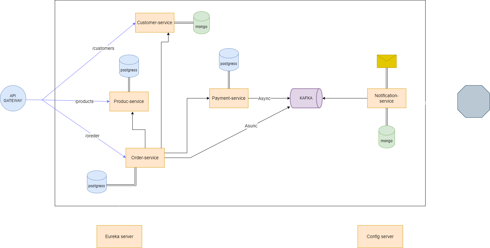

# E-Commerce Microservice Architecture

This project is a distributed microservice-based e-commerce system developed using **Spring Boot**. The architecture includes various independent services to handle specific functionalities, integrated via **Kafka**, **Feign Client**, and **Eureka Server**. Monitoring and tracing are enabled using **Zipkin** and **Docker**.

## Table of Contents
1. [Architecture Overview](#architecture-overview)
2. [Services](#services)
   - [Config Server](#config-server)
   - [Customer Service](#customer-service)
   - [Discovery Service (Eureka)](#discovery-service-eureka)
   - [API Gateway](#api-gateway)
   - [Notification Service](#notification-service)
   - [Order Service](#order-service)
   - [Payment Service](#payment-service)
   - [Product Service](#product-service)
3. [Technologies Used](#technologies-used)
4. [Prerequisites](#prerequisites)
5. [How to Run](#how-to-run)
6. [Tracing and Monitoring](#tracing-and-monitoring)
7. [Future Improvements](#future-improvements)

---

## Architecture Overview
This project consists of multiple Spring Boot microservices communicating through **Kafka** and **Feign Clients**. Each service is independently deployable and scalable. 

The services are registered in the **Eureka Discovery Server** and managed centrally using a **Config Server**. **Zipkin** is integrated for distributed tracing and monitoring of requests across the system.

---

## Services

### Config Server
- Manages centralized configuration for all microservices.
- Ensures consistency and ease of configuration changes.

### Customer Service
- Handles customer-related operations.
- Stores customer data in **MongoDB**.
- Exposes `/customers` API endpoint.

### Discovery Service (Eureka)
- A registry service for all microservices to enable service discovery and load balancing.

### API Gateway
- A single entry point for all APIs.
- Routes requests to the appropriate service.
- Implements security and rate limiting.

### Notification Service
- Listens to **Kafka** events and sends notifications.
- Stores notification history in **MongoDB**.
- Integrates with email services for notifications.

### Order Service
- Manages customer orders and processes them.
- Communicates asynchronously with **Payment Service** using **Kafka**.
- Stores data in **PostgreSQL**.

### Payment Service
- Processes payments for orders.
- Publishes events to **Kafka** for asynchronous communication.

### Product Service
- Manages product inventory and details.
- Exposes `/products` API endpoint.
- Stores data in **PostgreSQL**.

---

## Technologies Used
- **Spring Boot**: Application framework for developing microservices.
- **Eureka Server**: Service discovery and registration.
- **Spring Cloud Gateway**: API Gateway for routing requests.
- **Spring Cloud Config**: Centralized configuration management.
- **Kafka**: Event streaming platform for asynchronous communication.
- **Feign Client**: Declarative REST client for service-to-service communication.
- **PostgreSQL**: Relational database for structured data.
- **MongoDB**: NoSQL database for flexible and scalable storage.
- **Zipkin**: Distributed tracing and monitoring.
- **Docker**: For using docker images from docker repository to use it in my project (docker compose file) .

---

master branch => E-Commerce microservice using spring boot  
Camunda-nginx branch => adding nginx and camunda to the architecture
